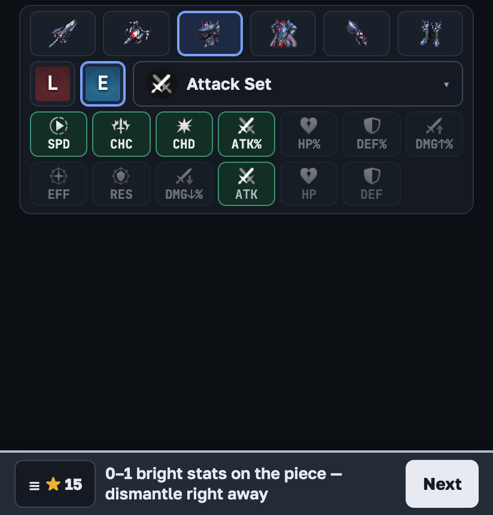
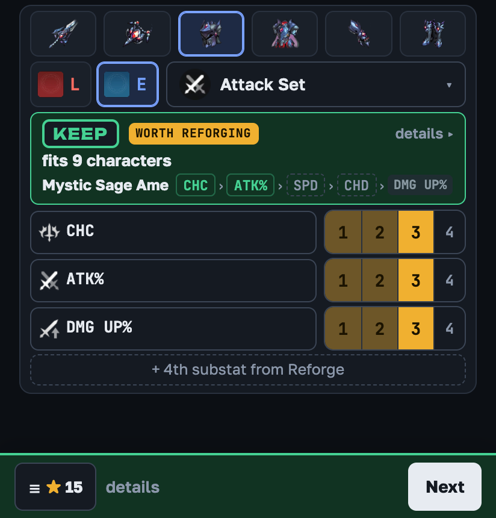
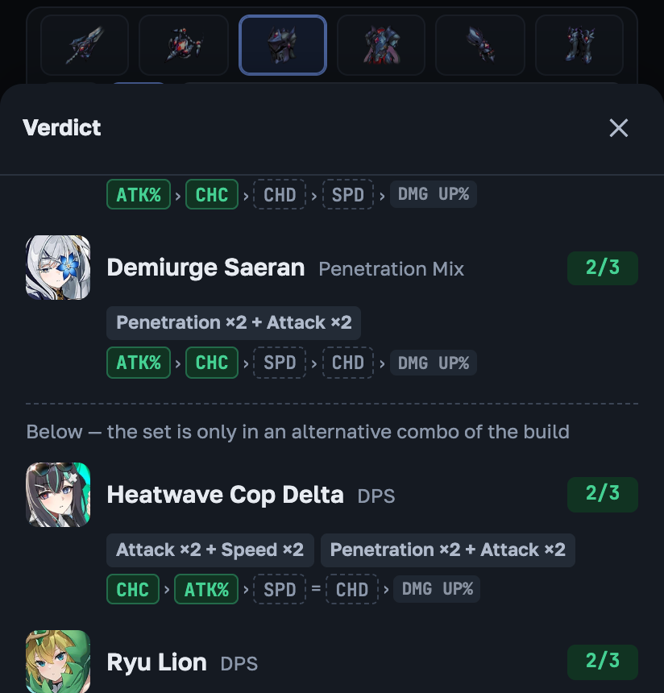
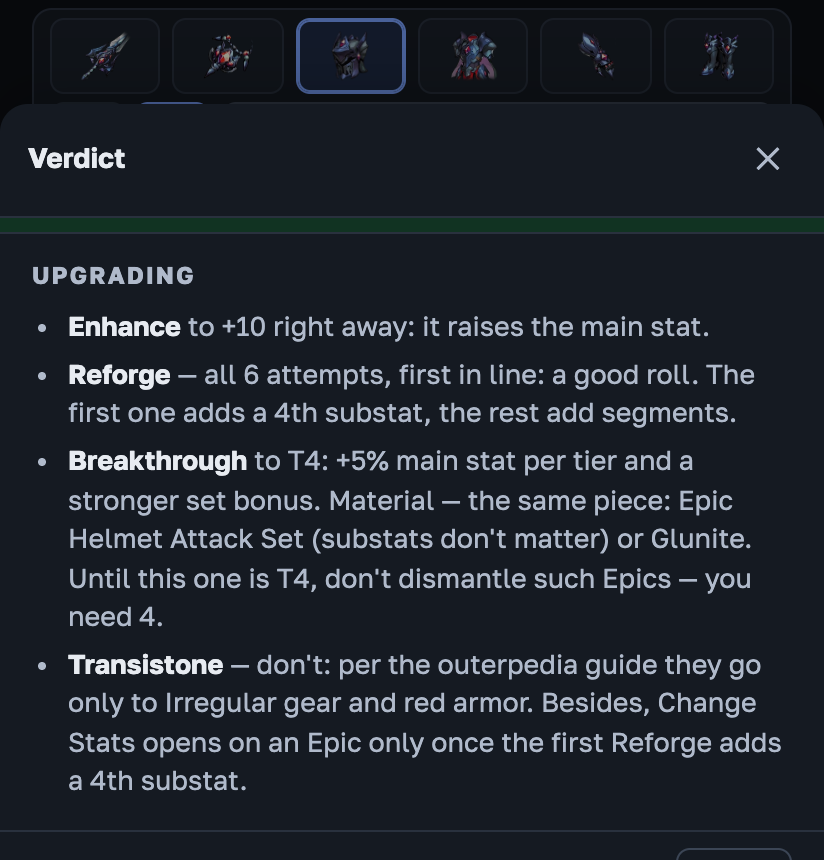

# Outerplane Gear Check

Keep or dismantle? Open it next to Outerplane — on a phone in split-screen mode — enter a gear piece in a few taps
and see the verdict right away: **Keep, Stopgap, Fodder, Maybe or Dismantle**, why, and which of your characters it
suits. Builds come from [outerpedia](https://github.com/Sevih/outerpedia)'s curated recommendations.

**▶ Open: [cotton-more.github.io/outerplane-gear-check](https://cotton-more.github.io/outerplane-gear-check/)** —
works in the browser, installs on a phone as an app, works offline. English and Russian (☰ menu → language).

<table>
<tr>
<td width="50%"></td>
<td width="50%"></td>
</tr>
<tr>
<td>Pick the set — the stats it needs light up. 0–1 bright stats on the piece? Dismantle without entering anything.</td>
<td>Mark the substats — the verdict replaces the grid: what the best candidate needs and what of it the piece has.</td>
</tr>
<tr>
<td></td>
<td></td>
</tr>
<tr>
<td>Who it suits: each character's substat priority chain and what of it matched.</td>
<td>Upgrading: what to invest in this piece — Enhance, Reforge, Breakthrough, Transistone.</td>
</tr>
</table>

## Install on your phone

- **Android (Chrome):** open the link, menu ⋮ → "Install app".
- **iPhone and iPad:** in Safari, "Share" → "Add to Home Screen".

## Guide

The full guide is in the **[Wiki](https://github.com/cotton-more/outerplane-gear-check/wiki)**:
[Getting started](https://github.com/cotton-more/outerplane-gear-check/wiki/Getting-started) ·
[Fast cleanup](https://github.com/cotton-more/outerplane-gear-check/wiki/Fast-cleanup) ·
[Reading the verdict](https://github.com/cotton-more/outerplane-gear-check/wiki/Reading-the-verdict) ·
[How verdicts work](https://github.com/cotton-more/outerplane-gear-check/wiki/How-verdicts-work) ·
[Upgrading](https://github.com/cotton-more/outerplane-gear-check/wiki/Upgrading).
The app has a short one too: ☰ → Help.

**По-русски:** руководство — в [Wiki](https://github.com/cotton-more/outerplane-gear-check/wiki/Начало-работы),
язык приложения — меню ☰.

## Credits

Game data and images belong to Major9 / VA Games; builds are the work of outerpedia's authors. This is an unofficial
fan tool, not affiliated with the publisher or with outerpedia. Build recommendations, game tables and the flat/%
formula come from [outerpedia](https://github.com/Sevih/outerpedia) under the MIT license; the page also bundles React
(MIT). Full license texts: the app footer ("Licenses") and [`src/licenses.ts`](src/licenses.ts).

Development notes (in Russian): [DEVELOPMENT.md](DEVELOPMENT.md).
