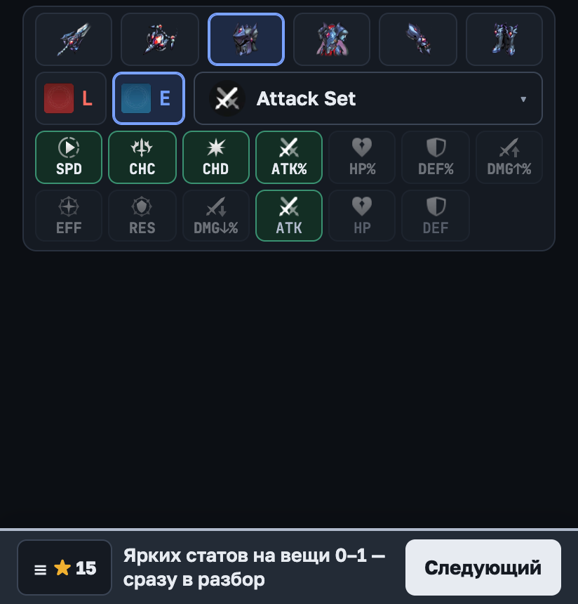
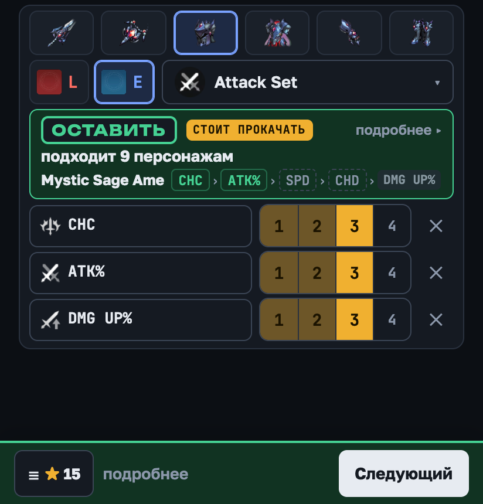
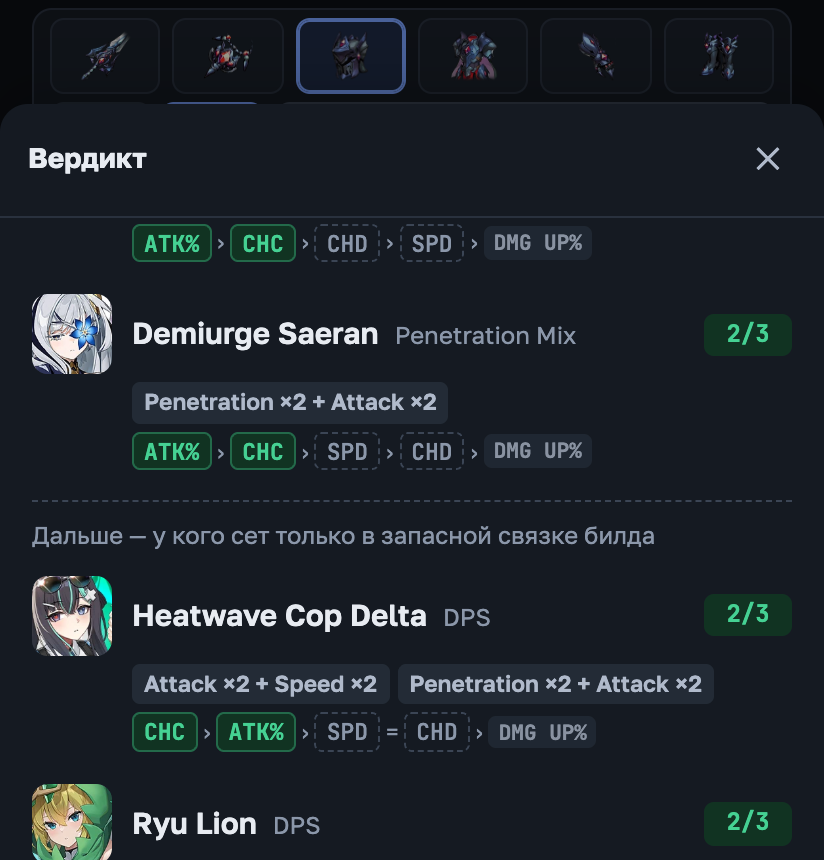
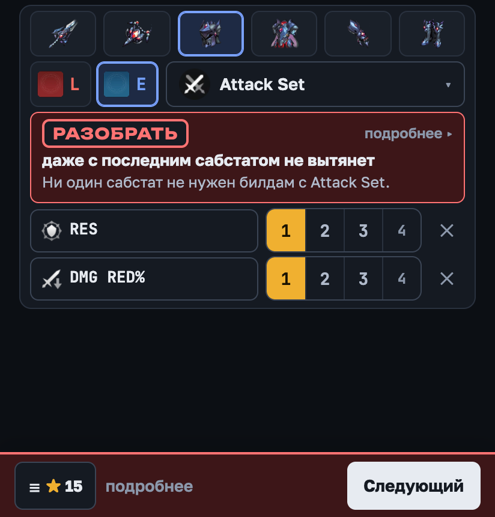

# Outerplane Gear Check

Что оставить, а что разобрать в Outerplane. Открываешь рядом с игрой — на телефоне в режиме разделённого
экрана, — в несколько нажатий вбиваешь предмет и сразу видишь вердикт: **Оставить, Временно, Фоддер, Спорно
или Разобрать**, почему, и кому из твоих персонажей он подходит.

**Открыть: [cotton-more.github.io/outerplane-gear-check](https://cotton-more.github.io/outerplane-gear-check/)** —
работает в браузере, ставится на телефон как приложение, без сети тоже работает. Есть английская версия (меню ☰ → язык).

<table>
<tr>
<td width="50%"></td>
<td width="50%"></td>
</tr>
<tr>
<td>Выбрал сет — нужные ему статы подсвечены. Ярких на вещи 0–1? Сразу в разбор, ничего не вводя.</td>
<td>Отметил сабстаты — вердикт на месте сетки: что нужно лучшему кандидату и что из этого есть на вещи.</td>
</tr>
<tr>
<td></td>
<td></td>
</tr>
<tr>
<td>«Кому подходит»: цепочка приоритета каждого персонажа и что из неё совпало.</td>
<td>Два ненужных сабстата — вердикт сразу, третий можно не вводить.</td>
</tr>
</table>

Билды — из курированных рекомендаций [outerpedia](https://github.com/Sevih/outerpedia): 265 билдов 95 персонажей.
Свежие данные outerpedia проверяются каждый день и выходят на сайт после проверки.

## Установка на телефон

- **Android (Chrome):** открой ссылку, меню ⋮ → «Установить приложение» (или кнопка «Установить» в меню ☰).
- **iPhone и iPad:** в Safari «Поделиться» → «На экран „Домой“».

Появится иконка: приложение открывается без адресной строки и подходит для разделённого экрана с игрой.
Когда выйдут новые данные, при открытии появится плашка «Обновить».

## С чего начать

1. **Отметь своих персонажей**: ☰ → «Персонажи», звёздочка у каждого твоего. Пока ростер пуст, оценка идёт
   по всем персонажам игры. На другое устройство ростер переносится кодом («экспорт / импорт»).
2. **Раздели экран**: игра в одной половине, Gear Check в другой.
3. **Вбей вещь:**
   - слот (строка иконок) и грейд: `L` — Legendary (Etheric), `E` — Epic (Steel);
   - **броня** — сет, он в названии после «of» (`Etheric Gloves of Speed` → Speed Set);
     **Legendary оружие и аксессуар** — найди предмет, потом main stat; **Epic оружие и аксессуар** — сразу main stat;
   - **сабстаты** — нажми их в сетке по порядку, как в игре; жёлтые сегменты — кнопками 1–4 в строке стата.
     ATK%, HP% и DEF% стоят над своими flat-версиями, чтобы не перепутать. Ошибся в стате — нажми на него в строке
     и выбери другой (сегменты останутся) или «Убрать». Убрать можно и повторным нажатием в сетке.
   - **4-й сабстат у Epic-брони:** Epic выпадает с тремя, четвёртый добавляет первый Reforge — кнопка
     «+ 4-й сабстат от Reforge» под строками (у синего оружия и аксессуаров 4-й ничего не решает — кнопки там нет). Четвёртый может вытянуть вещь: два хороших и третий так себе плюс выпавший SPD — уже «Оставить».
4. **Прочитай вердикт** на карточке; «подробнее» — полный разбор, кому подходит и код вещи.
5. **«Следующий»** — к следующей вещи: слот, грейд и сет остаются. Нажал по ошибке — «Вернуть».

Всё ниже 6★ и всё ниже Epic — сразу в разбор, вбивать не нужно.

## Как быстро разбирать инвентарь

1. В игре отсортируй инвентарь по дате получения — подряд обычно идут дропы одного забега, и сет остаётся с прошлой вещи.
2. **Epic-броня:** выбери слот и сет и посмотри на сетку. Если ярких статов на вещи 0–1 — в разбор, ничего не вводя:
   «Оставить» и «Временно» так не бывает никогда (это проверено перебором всех сочетаний). Для узких сетов вроде
   Attack и Critical Strike так отсеивается около половины вещей; у Speed, Immunity и Swiftness ярко почти всё — там вводи.
3. После двух ненужных сабстатов у Epic вердикт появляется сразу — третий можно не вводить.
4. «Оставить» — поставь замок, чтобы не разобрать случайно. «Временно» — носи, пока не найдёшь лучше.
   **Breakthrough у Epic** — только такой же вещью: Epic того же сета и слота, сабстаты не важны. Есть Epic-«Оставить»
   ещё не на T4 — Epic того же сета и слота из разбора откладывай ему (нужно 4 штуки), вердикт об этом напомнит.
5. **Epic оружие и аксессуар:** на этапе «Эндгейм» — в разбор; на «Развитии» сначала main stat: если в окне у него
   0 желающих — в разбор.
6. **Legendary** с настройкой «коплю фоддер» (включена по умолчанию): вердикт покажет, какие прокачивать,
   а какие оставить на Breakthrough.

## Как читать вердикт

| Вердикт | Что делать |
|---|---|
| **Оставить** | вещь нужна: носи и прокачивай — что именно, написано в блоке «Прокачка». «Стоит Reforge» — ролл хороший, Reforge вкладывать сюда в первую очередь |
| **Временно** | носи, пока не найдёшь лучше: у оружия и аксессуара нет нужной пассивки, у Epic-брони только один главный стат (вердикт называет недостающий) |
| **Фоддер** | оставь на Breakthrough: Legendary-броня со слабыми сабстатами или предмет с нужной пассивкой, но не тем main stat |
| **Спорно** | решай сам: в подробностях написано, в чём сомнение (например, вещь хороша для персонажа не из твоего ростера) |
| **Разобрать** | твоим персонажам не подходит или ролл слабый |

**Цепочка приоритета** — порядок сабстатов, которые нужны персонажу, слева важнее: `ATK% › CHC › SPD › CHD › DMG UP%`.
Зелёный — стат есть на вещи и засчитан, жёлтый — засчитан за ½, серый — есть, но слишком далеко в цепочке,
пунктир — нет на вещи, зачёркнутый в конце — на вещи есть, персонажу не нужен. Считаются первые четыре места.

В «Кому подходит» сначала идут те, у кого сет в основе билда, потом, после разделителя, — у кого он только в запасной
связке: шлем Attack Set прежде всего для атакеров с Attack ×4, а не для Heatwave Cop Delta, у которой Attack только в
связках 2 + 2.

## Код вещи для гильдии

В подробностях вердикта есть код, например `OGC KXRM TPWA`. «Скопировать» — и вставь в чат игры (8–11 букв при
лимите 50 символов). Кто получил — ☰ → «Ввести код» и перепечатывает: в коде только буквы, регистр и пробелы не
важны, опечатку поймает контрольная буква. Оценка у каждого — по своему ростеру и настройкам.

## Как считается вердикт

**Броня.** «Полезный» сабстат — тот, что стоит на 1–3 месте в цепочке приоритета билда (4-е место — за ½, SPD — на
любом). Связка вроде `SPD=CHD` делит одно место, а следующий стат встаёт после всех её статов: в
`CHC › ATK › SPD=CHD › DMG UP%` у DMG UP% пятое место. Берётся лучший билд среди персонажей, которые носят этот сет.

- Оставить: 3+ полезных, или 2 полезных, если среди них SPD с 2+ жёлтыми сегментами.
- Epic строже: его не исправить камнями (по гайду outerpedia Transistone на Epic не тратят, в Breakthrough он не годится),
  поэтому решают главные статы — первые два места цепочки — и ролл на них:
  - «Оставить» — три полезных, если среди них SPD или главный стат, либо 5+ жёлтых на полезных; или два главных стата
    с 5+ жёлтыми на них — тогда третий может быть любым;
  - «Временно» — главный стат с 2+ жёлтыми и ещё полезный, вместе 5+: носи, пока не выпадет вещь с недостающим главным
    статом; держать стоит 1–2 такие на сет и слот;
  - иначе — «Разобрать».
  Ловушка «всё про атаку»: DMG UP% даёт +2% за сегмент против +4% у ATK% и CHD, flat ATK (+40) слабее ATK% у персонажей
  с высокой базой, CHD без CHC работает вполсилы — такие вещи выглядят атакующими, но главных статов на них нет.
- Не дотянула Legendary — «Фоддер»: для Breakthrough и реролла Transistone (Total) сабстаты не важны, и гайд outerpedia
  советует такую красную броню не разбирать (держать стоит не больше 4 на сет и слот). Не копишь фоддер — выключи
  это в настройках, тогда и Legendary пойдёт в «Разобрать».
- Legendary с одним лишним сабстатом из четырёх: вердикт называет его — Transistone (Individual) меняет только
  этот сабстат, остальные три закрепляются.
- Отмечен flat ATK/DEF/HP, который не засчитался, а %-версия нужна, — вердикт просит проверить знак %:
  частая путаница — на вещи HP%, а отмечен HP.
- Сеты, которых нет ни в одном билде outerpedia (Critical Hit, Resilience, Fortification, Mitigation, Lifesteal,
  Bursting, Pulverization, Weakness), — «скорее разбирай» с объяснением.

**Flat ATK/DEF/HP.** %-сабстат умножает собственную базу персонажа, flat прибавляет фиксированное число, поэтому
ценность flat считается для каждого персонажа отдельно, тем же расчётом, что на outerpedia. В среднем flat ATK ≈ 0.9
от ATK%, flat DEF ≈ 1.0 от DEF%, flat HP ≈ 0.6 от HP%. Уровень (100/120) и Quirks — в настройках (меню ☰).

**Оружие и аксессуары.**

- Legendary с пассивкой из билдов и нужным main stat — оставить.
- С той же пассивкой, но не тем main stat — фоддер для Breakthrough (main stat не перебрасывается).
- **Временно**: предмет без нужной пассивки (любой Epic, Legendary не из билдов или «нет в списке») с main stat, который
  персонажи просят в этом слоте, **и хорошим роллом**: у Epic — 3 полезных или 2 полезных с 5+ жёлтыми; у Legendary —
  3 полезных. Иначе — «Разобрать». Держи 1–2 лучших на каждый нужный main stat.
- Этап «Эндгейм» в настройках отключает временные замены: в разбор идёт всё, что не рекомендовано. Исключение —
  совсем новый Legendary «нет в списке»: пока его нет в данных outerpedia, он получает «Спорно».

**Ролл** — «полезных N из M, жёлтых сегментов на них X из 3·M» и сколько оранжевых сегментов Reforge в среднем добавит
полезным статам: Reforge усиливает один сабстат из четырёх, поэтому вещь с 3 полезными из 4 получит в дело ~¾ из 6 попыток,
а с 2 из 4 — половину (у Epic первая попытка добавляет 4-й сабстат, сегментов 5). Если жёлтых и ожидаемых оранжевых
на полезных вместе 60%+ от идеала (все 4 сабстата полезны, по 3 жёлтых, все Reforge в них), появляется плашка «Стоит Reforge».

**Прокачка** — блок в подробностях вердикта: что вкладывать в эту вещь.

| Вердикт | Что вкладывать |
|---|---|
| **Оставить** | Enhance до +10 сразу; Reforge — в первую очередь при хорошем ролле, у оружия со слабыми сабстатами — после реролла; Breakthrough до T4 (+5% к main stat за ступень, сильнее пассивка оружия и бонус сета): материал — такая же вещь или Glunite; у Epic — не Transistone |
| **Временно** | только Enhance: вещь на замену. У Epic-брони из дропа — один Reforge на удачу, если какой-то 4-й сабстат сделал бы её «Оставить»: блок назовёт какие |
| **Фоддер** | ничего: это ступень Breakthrough для такой же вещи |
| **Разобрать** Epic-броню | тоже подсказка про Reforge на удачу, если 4-й сабстат может спасти; и напоминание: если есть Epic-«Оставить» того же сета и слота не на T4, это материал для него |

Какой 4-й сабстат спасёт вещь, считает та же оценка: перебирает все статы, которых на вещи нет, с одним жёлтым сегментом.
Смена статов (Transistone) у Epic тоже открывается только с 4-м сабстатом — но по гайду outerpedia тратить их на Epic не стоит.

## Персонажи

Вторая вкладка (☰ → «Персонажи»): поиск по имени и все билды outerpedia — сеты с альтернативами, оружие и аксессуар
с main stat, приоритет сабстатов с подсказкой flat/%, талисманы, заметка. Ссылка `…/#demiurge-stella` сразу открывает
персонажа. Всё, что ты отмечаешь, хранится только в твоём браузере — никуда не отправляется.

## Ограничения

- Рекомендации outerpedia в основном PvE; сеты без билдов могут иметь нишевое PvP-применение.
- Вещь вбивается руками: приложение не видит инвентарь игры (варианты на будущее — в [AUTOINPUT.md](AUTOINPUT.md)).
- Число сабстатов у Epic (3, четвёртый — от первого Reforge) и сколько копий нужно для T4 — со слов гайдов и проверки
  в игре, в данных игры этого нет.
- Оранжевые сегменты (от Reforge) не вводятся — только жёлтые: вещь оценивается как из дропа, плюс 4-й сабстат у Epic.
- Классовые версии Briareos/Gorgon называются одинаково: класс видно по иконке и суффиксу пассивки.
- Эффект EFF/RES-сабстатов в данных игры не до конца ясен, поэтому они оцениваются только по приоритетам билдов.

## Лицензии и права

Игровые данные и изображения принадлежат Major9 / VA Games; билды — работа авторов outerpedia.
Это неофициальный фанатский инструмент, не связанный ни с издателем, ни с outerpedia.

Рекомендации по билдам, игровые таблицы и формула flat/% взяты из [outerpedia](https://github.com/Sevih/outerpedia)
под лицензией MIT; в страницу также встроен React (MIT). Строки copyright и полный текст лицензии — в подвале страницы
(«Лицензии») и в [`src/licenses.ts`](src/licenses.ts).

Как устроен проект, как собрать и обновить данные — [DEVELOPMENT.md](DEVELOPMENT.md).
